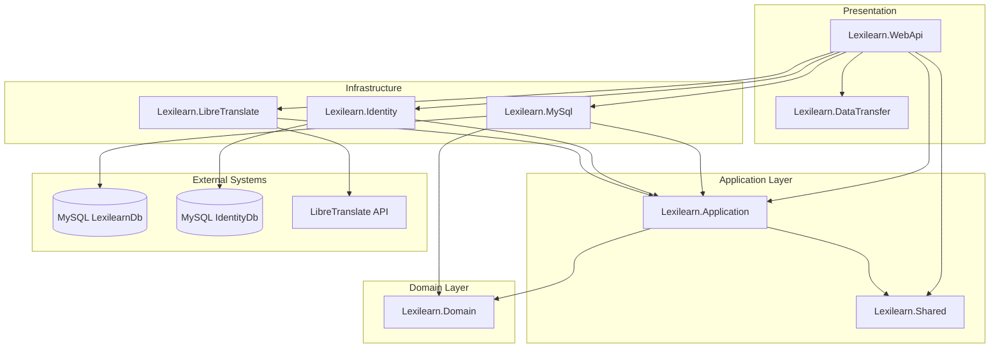
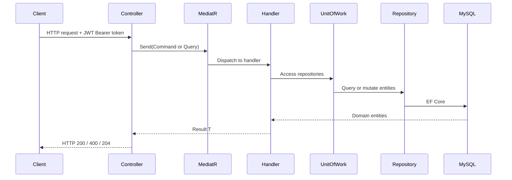
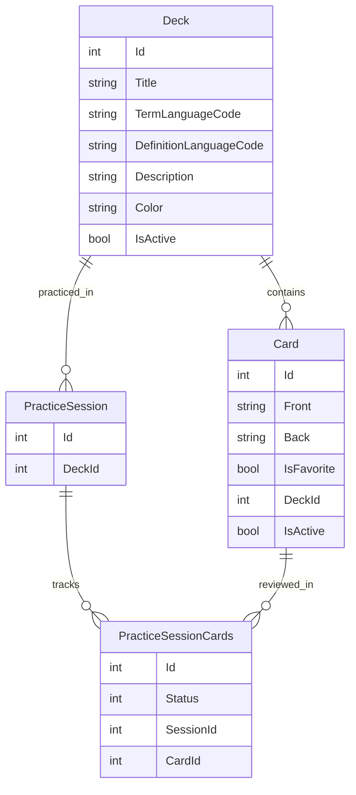

# Lexilearn Architecture

## Table of Contents

1. [Overview](#overview)
2. [Solution Structure & Project Responsibilities](#solution-structure--project-responsibilities)
3. [Architecture Patterns](#architecture-patterns)
4. [Layer-by-Layer Breakdown](#layer-by-layer-breakdown)
5. [Request & Data Flow](#request--data-flow)
6. [API Endpoints](#api-endpoints)
7. [Domain Model](#domain-model)
8. [Persistence & Databases](#persistence--databases)
9. [Authentication & Authorization](#authentication--authorization)
10. [External Integrations](#external-integrations)
11. [Technology Stack](#technology-stack)
12. [Configuration & Environment](#configuration--environment)
13. [Deployment (Docker)](#deployment-docker)
14. [Known Gaps & Technical Debt](#known-gaps--technical-debt)

---

## Overview

**Lexilearn** is a language-learning platform centered on flashcard decks, individual cards, and practice sessions. It exposes a REST API for managing learning content and integrates with **LibreTranslate** for text translation.

The solution has a single runnable application:

| Application | Project | Purpose |
|-------------|---------|---------|
| **REST API** | `Lexilearn.WebApi` | ASP.NET Core Web API — composition root, HTTP endpoints, auth pipeline, OpenAPI/Swagger |

All projects target **.NET 9** and are organized in a **Clean Architecture** style with clear layer boundaries and dependency inversion.

---

## Solution Structure & Project Responsibilities

The solution (`Lexilearn.sln`) groups 8 library/API projects under logical folders: `API`, `Core`, `Infrastructure`, `Persistence`, and `Common`, plus test projects under `tests`.



### Project reference graph

```
Lexilearn.Domain          (no dependencies)
Lexilearn.Shared          (no dependencies)
Lexilearn.DataTransfer    (no dependencies)
        ↑
Lexilearn.Application  → Domain, Shared
        ↑
Lexilearn.MySql        → Application, Domain
Lexilearn.Identity     → Application
Lexilearn.LibreTranslate → Application
        ↑
Lexilearn.WebApi       → DataTransfer, LibreTranslate, Application, Identity, MySql, Shared
```

| Project | Layer | Responsibility |
|---------|-------|----------------|
| `Lexilearn.Domain` | Domain | Entities (`Deck`, `Card`, `PracticeSession`), base classes, enums — zero external dependencies |
| `Lexilearn.Application` | Application | CQRS handlers (MediatR), contracts, Mapster mappings, result models |
| `Lexilearn.MySql` | Infrastructure / Persistence | EF Core DbContext, repositories, unit of work, migrations |
| `Lexilearn.Identity` | Infrastructure / Persistence | JWT authentication, `AuthService`, identity DbContext |
| `Lexilearn.LibreTranslate` | Infrastructure | HTTP adapter for the LibreTranslate translation API |
| `Lexilearn.DataTransfer` | Common | API request/response DTOs used by WebApi controllers |
| `Lexilearn.Shared` | Common | Cross-cutting types (e.g. `PaginationSettings`) |
| `Lexilearn.WebApi` | Presentation | Composition root, controllers, middleware pipeline, OpenAPI |

---

## Architecture Patterns

### Clean Architecture (layered / onion)

Dependencies point inward. The **Application** layer defines contracts (`Contracts/Persistence`, `Contracts/Identity`, `Contracts/Infastructure`), and infrastructure projects implement them. `Lexilearn.WebApi` is the **composition root** — it wires all services via extension-method registrations in `Program.cs`.

### CQRS via MediatR

Commands and queries are organized under `Lexilearn.Application/Features/`:

| Feature area | Commands | Queries |
|--------------|----------|---------|
| **Decks** | Create, Edit, Delete | GetDeck, GetDecks |
| **Cards** | Create, Edit, Delete | GetCard, GetCardsByDeck |
| **PracticeSession** | SavePracticeSession | GetSessionHistory |
| **Translation** | TranslateText | — |

Controllers dispatch requests via `IMediator.Send(...)`. The exception is `AuthController`, which calls `IAuthService` directly.

### Repository + Unit of Work

- Generic repository: `IAsyncRepository<T>` → `RepositoryBase<T>`
- Specialized repositories: `IDeckRepository`, `ICardRepository`, `IPracticeSessionRepository`, `IPracticeSessionCardsRepository`
- Coordinated through `IUnitOfWork` / `UnitOfWork` with `Complete()` to persist changes

### Result pattern

Handlers return `Result<T>` or `SoftResult` from `Lexilearn.Application/Models/` for business-level success/failure, avoiding exceptions for expected error cases.

### DDD-lite

- Entity hierarchy with audit and soft-delete support
- Relationships: `Deck` → `Cards`, `PracticeSession` → `PracticeSessionCards`
- `CardStatus` enum in `Lexilearn.Domain/Enums/`
- Business logic lives primarily in MediatR handlers rather than rich domain methods

### Object mapping

**Mapster** (`MappingProfile` in Application, `IMapper` injected in controllers) maps between DTOs, commands/queries, and domain entities.

---

## Layer-by-Layer Breakdown

### Domain (`Lexilearn.Domain`)

Pure domain model with no framework dependencies.

```
Lexilearn.Domain/
├── Card.cs
├── Deck.cs
├── PracticeSession.cs
├── PracticeSessionCards.cs
├── Common/
│   ├── BaseDomainModel.cs
│   ├── AuditoryBaseDomain.cs
│   └── NonAuditoryBaseDomain.cs
└── Enums/
    └── CardStatus.cs
```

### Application (`Lexilearn.Application`)

Use-case orchestration, contracts, and feature handlers.

```
Lexilearn.Application/
├── ApplicationServiceRegistration.cs
├── Contracts/
│   ├── Identity/IAuthService.cs
│   ├── Infastructure/ITranslationService.cs
│   └── Persistence/ (IAsyncRepository, IUnitOfWork, specialized repos)
├── Features/
│   ├── Lexilearn/ (Cards, Decks, PracticeSession)
│   └── Translation/
├── Mappings/MappingProfile.cs
└── Models/ (Identity, LexiLearn, LibreTranslate)
```

### Infrastructure

| Project | Key contents |
|---------|--------------|
| `Lexilearn.MySql` | `LexilearnDbContext`, `UnitOfWork`, repositories, EF fluent configurations, migrations |
| `Lexilearn.Identity` | `AuthService`, `LexilearnIdentityDbContext`, `User` model, JWT configuration |
| `Lexilearn.LibreTranslate` | `TranslationService`, `LibreTranslateSettings` |

### Presentation

| Project | Key contents |
|---------|--------------|
| `Lexilearn.WebApi` | `Program.cs`, 5 controllers, `appsettings.json`, Dockerfile |
| `Lexilearn.DataTransfer` | Request/response DTOs for Cards, Decks, PracticeSessions, Translation |

---

## Request & Data Flow

### Typical authenticated request (CQRS)



### Composition root (`Lexilearn.WebApi/Program.cs`)

```csharp
builder.Services.AddControllers();
builder.Services.AddOpenApi();
builder.Services.AddApplicationServices();
builder.Services.AddInfrastructureLibreTranslateService(builder.Configuration);
builder.Services.AddPersistenceServices(builder.Configuration);
builder.Services.ConfigureIdentityService(builder.Configuration);
builder.Services.AddAuthorization();
```

### HTTP pipeline

1. CORS (configured origins in production; permissive in Development when none configured)
2. OpenAPI + Swagger UI (Development only, at `/swagger`)
3. HTTPS redirection
4. Authentication → Authorization
5. Controller routing

---

## API Endpoints

| Controller | Base route | Auth | Dispatch pattern |
|------------|------------|------|------------------|
| `AuthController` | `api/Auth` | Public | `IAuthService` |
| `DecksController` | `api/Decks` | JWT `[Authorize]` | MediatR |
| `CardsController` | `api/Cards` | JWT `[Authorize]` | MediatR |
| `PracticeSessionController` | `api/PracticeSession` | JWT `[Authorize]` | MediatR |
| `TranslationController` | `api/Translation` | JWT `[Authorize]` | MediatR |

### Endpoint details

**Auth** (`api/Auth`)
- `POST api/Auth/Login` — authenticate and receive JWT
- `POST api/Auth/Register` — create a new user account

**Decks** (`api/Decks`)
- `POST api/Decks` — create deck
- `PATCH api/Decks` — update deck
- `GET api/Decks/{id}` — get deck by id
- `GET api/Decks` — list decks (paginated via `PaginationSettings`)
- `DELETE api/Decks/{id}` — soft-delete deck

**Cards** (`api/Cards`)
- `POST api/Cards` — create card
- `PATCH api/Cards` — update card
- `GET api/Cards/{id}` — get card by id
- `GET api/Cards/Deck/{deckId}/` — list cards in a deck
- `DELETE api/Cards/{id}` — soft-delete card

**Practice Session** (`api/PracticeSession`)
- `POST api/PracticeSession` — save a practice session
- `GET api/PracticeSession/StartDate/{startDate}/EndDate/{endDate}` — session history

**Translation** (`api/Translation`)
- `POST api/Translation` — translate text via LibreTranslate

---

## Domain Model

### Entity hierarchy

```
BaseDomainModel
├── Id, CreatedDate, CreatedBy
│
├── AuditoryBaseDomain          (soft-delete + audit)
│   ├── LastModifiedDate, LastModifiedBy, IsActive
│   ├── Deck
│   └── Card
│
└── NonAuditoryBaseDomain
    ├── PracticeSession
    └── PracticeSessionCards
```

### Entity relationships



### Key domain concepts

- **Deck** — a collection of flashcards with term/definition language codes, optional description and color
- **Card** — front/back text belonging to a deck, with an optional favorite flag
- **PracticeSession** — a study session against a deck
- **PracticeSessionCards** — per-card outcome within a session (status tracked via `CardStatus` enum)

---

## Persistence & Databases

### Two-database design

| Database | Connection string key | Contents |
|----------|----------------------|----------|
| `LexilearnDb` | `ConnectionStrings:LexilearnDb` | Decks, cards, practice sessions |
| `IdentityDb` | `ConnectionStrings:IdentityDb` | Users and authentication data |

Separating identity from application data allows independent scaling and migration of each concern.

### ORM & provider

- **Entity Framework Core 9** with **Pomelo.EntityFrameworkCore.MySql** provider
- Fluent API configurations in `Lexilearn.MySql/Configuration/`
- EF Core migrations:
  - `Lexilearn.MySql/Migrations/` — 3 migrations (Initial, AddedAuditory, UpdateSessionTable)
  - `Lexilearn.Identity/Migrations/` — 1 migration (Initial)

### Audit & soft-delete

`LexilearnDbContext` stamps `CreatedDate`, `CreatedBy`, `LastModifiedDate`, and `LastModifiedBy` on save. Auditory entities use `IsActive` for soft-delete instead of physical removal.

### Repository layout

```
Lexilearn.MySql/
├── Persistence/
│   ├── LexilearnDbContext.cs
│   ├── UnitOfWork.cs
│   └── UnitOfWorkRepositories.cs
├── Repository/
│   ├── Base/RepositoryBase.cs
│   ├── DeckRepository.cs
│   ├── CardRepository.cs
│   ├── PracticeSessionRepository.cs
│   └── PracticeSessionCardsRepository.cs
└── PersistenceServiceRegistrartion.cs
```

---

## Authentication & Authorization

### JWT Bearer

Configured in `Lexilearn.Identity/IdentityServiceRegistration.cs` using `Microsoft.AspNetCore.Authentication.JwtBearer`. Token settings come from `JwtSettings` in configuration (Key, Issuer, Audience).

### Custom auth (not ASP.NET Identity framework)

Despite referencing `Microsoft.AspNetCore.Identity` packages, the project uses a custom `User` entity and `LexilearnIdentityDbContext` with `AuthService` for login/register. Passwords are hashed with **BCrypt** (`BCrypt.Net`).

### Token generation

`AuthService` generates JWTs via `JwtSecurityTokenHandler` with `HmacSha256` signing.

### Authorization

- `[Authorize]` applied at controller level on Decks, Cards, PracticeSession, and Translation
- User identity extracted from JWT claims (`ClaimTypes.NameIdentifier`) in controllers
- Auth endpoints (`Login`, `Register`) are publicly accessible

---

## External Integrations

### LibreTranslate

The `Lexilearn.LibreTranslate` project provides an HTTP client adapter implementing `ITranslationService`. It POSTs to the LibreTranslate `/translate` endpoint.

Configuration (`LibreTranslateSettings`):

| Setting | Default (dev) |
|---------|---------------|
| `Host` | `http://localhost` |
| `Port` | `5000` |

The translation feature is exposed via `TranslationController` (authenticated).

---

## Technology Stack

### Runtime & language

| Technology | Version / detail |
|------------|------------------|
| .NET | 9.0 (`net9.0`) |
| C# | Nullable reference types, implicit usings enabled |

### Backend API

| Package | Version | Purpose |
|---------|---------|---------|
| `Microsoft.AspNetCore.OpenApi` | 9.0.1 | OpenAPI document generation |
| `Swashbuckle.AspNetCore` | 8.1.1 | Swagger UI |
| `Swashbuckle.AspNetCore.SwaggerUI` | 8.1.1 | Swagger UI middleware |
| `MediatR` | 12.4.1 | CQRS command/query dispatch |
| `Mapster` | 7.4.0 | Object mapping |
| `Mapster.DependencyInjection` | 1.0.1 | DI integration for Mapster |
| `Microsoft.EntityFrameworkCore.Tools` | 9.0.3 | EF Core migrations CLI |
| `Microsoft.VisualStudio.Azure.Containers.Tools.Targets` | 1.21.0 | VS Docker tooling |

### Data

| Package | Version | Purpose |
|---------|---------|---------|
| `Pomelo.EntityFrameworkCore.MySql` | 9.0.0-preview.3 | MySQL EF Core provider |
| MySQL | — | Database engine (local dev) |

### Security

| Package | Version | Purpose |
|---------|---------|---------|
| `Microsoft.AspNetCore.Authentication.JwtBearer` | 9.0.4 | JWT Bearer authentication |
| `BCrypt.Net` | 0.1.0 | Password hashing |
| `Microsoft.AspNetCore.Identity` | 2.3.1 | Referenced but not actively used |
| `Microsoft.AspNetCore.Identity.EntityFrameworkCore` | 9.0.4 | Referenced but not actively used |

### External services

| Service | Integration |
|---------|-------------|
| LibreTranslate | HTTP POST via `Lexilearn.LibreTranslate` |

### DevOps & tooling

| Technology | Detail |
|------------|--------|
| Docker | Multi-stage Linux Dockerfile for WebApi (ports 8080/8081) |
| GitHub Actions | CI workflow: build and test on push/PR |
| docker-compose | MySQL, LibreTranslate, and WebApi for local full-stack dev |
| Visual Studio 2022 | Solution format 17.x |
| User Secrets | Configured on WebApi project for local secrets |
| EF Core Tools | Database migrations |

### Not present

| Missing | Notes |
|---------|-------|
| FluentValidation | Not used |
| AutoMapper | Not used (Mapster instead) |
| Serilog / structured logging | Default ASP.NET logging only |

### Legacy / ancillary (root)

A Node.js layer at the repo root (`indexapi.js`, `package.json`, `openapi.yaml`) serves a **Swagger Pet Store** sample spec via Express. This is unrelated to the .NET API, which generates its own OpenAPI document at `/openapi/v1.json` in Development.

---

## Configuration & Environment

### `Lexilearn.WebApi/appsettings.json`

| Section | Keys | Purpose |
|---------|------|---------|
| `ConnectionStrings` | `LexilearnDb`, `IdentityDb` | MySQL connection strings |
| `JwtSettings` | `Key`, `Issuer`, `Audience` | JWT signing and validation |
| `LibreTranslateSettings` | `Host`, `Port` | Translation service endpoint |
| `Logging` | `LogLevel` | ASP.NET logging levels |

Development overrides are in `appsettings.Development.json`.

### Local development URLs

| Application | HTTP | HTTPS |
|-------------|------|-------|
| WebApi | `http://localhost:5288` | `https://localhost:7241` |

### Prerequisites

- .NET 9 SDK
- MySQL server (with `LexilearnDb` and `IdentityDb` databases)
- LibreTranslate instance (for translation features)
- EF Core CLI (`dotnet ef`) for running migrations

---

## Deployment (Docker)

`Lexilearn.WebApi/Dockerfile` uses a multi-stage build:

1. **base** — `mcr.microsoft.com/dotnet/aspnet:9.0`, exposes ports 8080 and 8081
2. **build** — `mcr.microsoft.com/dotnet/sdk:9.0`, restores and builds
3. **publish** — publishes Release output
4. **final** — copies published artifacts, entrypoint `dotnet Lexilearn.WebApi.dll`

The WebApi project sets `DockerDefaultTargetOS` to **Linux**. A Docker launch profile is available in `launchSettings.json`.

---

## Known Gaps & Technical Debt

| Item | Detail |
|------|--------|
| **Auth bypasses CQRS** | `AuthController` uses `IAuthService` directly while all other endpoints use MediatR |
| **Legacy Node.js layer** | Root `indexapi.js` / `openapi.yaml` serve an unrelated Pet Store spec |
| **ASP.NET Identity packages unused** | Identity packages are referenced but custom auth is used instead |
| **Pomelo preview provider** | MySQL provider is a preview release (`9.0.0-preview.3`) |
| **CORS in production** | Configure `CorsSettings:AllowedOrigins` for production clients |
| **JWT key in appsettings** | Signing key should use secrets management in production |
